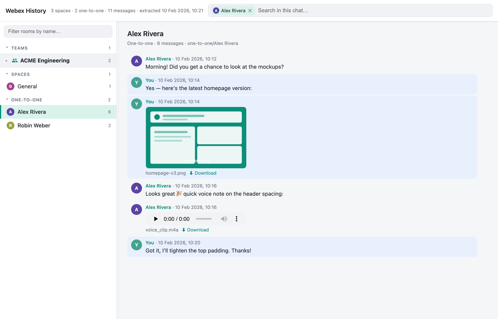

# Webex History Browser

A small, dependency-free tool to export a Webex account's chat history — team
spaces, standalone spaces, and one-to-one chats — to local files, download
attachments and person avatars, and browse everything offline in a single
searchable HTML page. Re-running only fetches and **appends** new messages, so it
doubles as an incremental local archive.



*Demo data — the browser groups rooms into Teams / Spaces / One-to-one, renders
image attachments as thumbnails and voice clips as audio players, and can search
within a chat or across everything.*

## Requirements

- **Python 3** (standard library only — no `pip install`, no third-party
  dependencies).
- A **Webex access token**. The quickest way is a personal token from
  <https://developer.webex.com> (log in → *Documentation* → any API → copy the
  *Bearer* token). Note: these personal tokens **expire ~12 hours** after they're
  issued, so each run needs a fresh one.

## Usage

```bash
export WEBEX_TOKEN='<token from developer.webex.com>'
python3 extract_webex.py
```

Then open **`index.html`** in a browser (double-click it — no server needed).

Re-run the same two commands later to fetch and **append** new
messages/attachments; the browser page is rebuilt automatically. No need to track
timestamps — the last message seen per room is remembered in
`webex-history/_state/extraction_state.json`.

### Options

| Flag | Effect |
|------|--------|
| `--only spaces` / `--only one-to-one` | Limit to one kind of room. |
| `--rooms <id,id>` | Extract only specific room IDs. |
| `--limit N` | Process at most N rooms per kind. |
| `--no-attachments` | Skip downloading attachment files and avatars. |
| `--base DIR` | Data directory (default: `./webex-history`). |

## Output layout

All exported data lives under `webex-history/`; only `index.html` sits at the top
level next to the scripts.

```
index.html                        The offline browser (open this)
webex-history/
  webex_data.js                   Data the browser loads
  teams/<team name>/<room>/       Spaces that belong to a Webex team
  spaces/<room>/                  Standalone spaces (no team)
  one-to-one/<person>/            Direct 1:1 chats
    ├── messages.jsonl            Every message, one JSON object per line (source of truth; appended)
    ├── transcript.md             Human-readable transcript
    ├── room.json                 Room metadata
    ├── members.json              Participants
    ├── attachments.json          Index of downloaded files
    └── files/                    Downloaded attachments
  avatars/                        Downloaded person avatars
  teams.json, people.json         Team names and person/avatar lookup
  _state/extraction_state.json    Per-room progress + run log (drives incremental append)
```

The browser groups rooms into collapsible **Teams**, **Spaces**, and
**One-to-one** sections, shows avatars, renders image attachments as thumbnails
and voice clips as inline audio players, and has full-text search across every
message. The whole `webex-history/` folder is **git-ignored** — only the scripts
and docs are meant to be committed.

### Notes & limitations

- Empty 1:1 titles (Webex sometimes returns none) are filled from the other
  participant's name or derived from their email.
- Voice/audio messages are downloaded and playable in the browser.
- Webex has **no public API for emoji reactions**, so those can't be exported.
- Teams and spaces have **no downloadable picture** in the public API — only people
  have avatars; teams show a generic icon.

## Files

| File | Purpose |
|------|---------|
| `extract_webex.py` | Extract + append messages, download attachments, regenerate transcripts. |
| `fetch_avatars.py` | Resolve people and download their avatars. |
| `build_browser.py` | Build the offline `index.html` + `webex_data.js`. |

## License

Licensed under the **Apache License 2.0** — see [`LICENSE`](LICENSE). No third-party
dependencies: only the Python standard library and self-contained, vanilla
HTML/CSS/JS.
